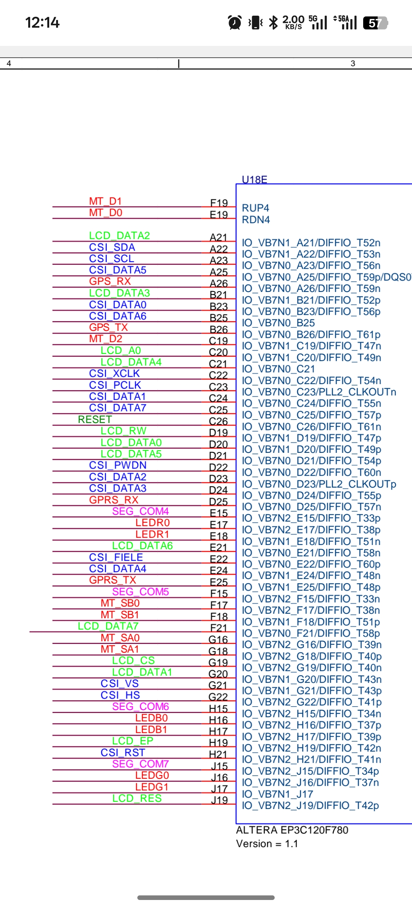
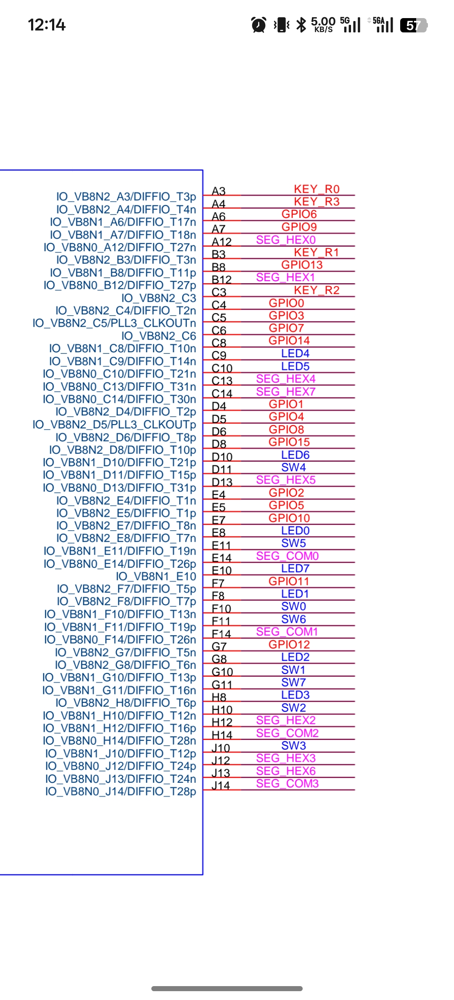

# 基于 Cyclone III EP3C120 的可设时倒计时闹钟系统 (FPGA 期末大作业)

本项目是一个基于 Altera (Intel) FPGA **Cyclone III EP3C120F780C8** 的数字倒计时闹钟系统。使用 **Quartus II (推荐版本 10.0 至 13.1)** 开发，采用 Verilog HDL 语言编写。该系统支持手动设置倒计时时、分、秒，通过数码管实时显示，并在倒计时结束时触发蜂鸣器警报以及 LED 与交通灯的交替闪烁。

## 🌟 项目功能特点

* **可设置倒计时时间**：支持通过按键手动增加时（Hour）、分（Minute）、秒（Second）。
* **独立消抖按键**：设计了按键消抖模块，确保按键触发准确无误。
* **8位数码管动态扫描显示**：采用动态扫描驱动 8 位数码管，实时显示 `HH-MM-SS`。
* **声光报警系统**：
  * 倒计时结束时触发蜂鸣器（高电平/低电平警报）。
  * 8位普通 LED 与 6位交通灯 LED 会随着警报同步交替闪烁。
  * 警报状态下，按下任意键可手动关闭警报。

---

## 🛠️ 硬件与开发环境

* **开发工具**：Quartus II 64-Bit (Version 10.0 / 13.1.0)
* **核心芯片**：Altera Cyclone III `EP3C120F780C8`
* **IO 电平标准**：3.3-V LVTTL

### 📸 实验板实物图


---

## 🔍 电气特性与逻辑电平分析

为了方便在不同的 FPGA 开发板上移植本工程，以下是关键外设的逻辑电平分析：

### 1. 按键逻辑（常态高/低电平）
* **复位按键 (`sw_rst`)**：**低电平有效**（Active-Low）。常态为高电平 `1`，按下时为低电平 `0` 触发系统复位。
* **功能按键 (`sw_h`, `sw_min`, `sw_sec`, `sw_ok`)**：**低电平有效**。
  * 消抖模块 `ax_debounce.v` 中对按键的下降沿进行检测（当检测到按键输入由 `1` 变为 `0` 并稳定时输出一个时钟周期的脉冲信号）。
  * 因此，开发板上的物理按键应接上拉电阻，按下时接地拉低。

### 2. 数码管逻辑（共阴极/共阳极）
在逻辑代码中，数码管驱动模块 `seg7_disp.v` 的信号定义如下：
* **段选信号 (`seg` / `a` 至 `g`, `p`)**：**高电平有效（1 点亮，0 熄灭）**。例如数字 `0` 的段码为 `8'b00111111`（a, b, c, d, e, f 对应高电平点亮）。
* **位选信号 (`com` / `com0` 至 `com7`)**：**高电平有效（1 选中，0 未选中）**。代码中采用 `com[sel] = 1'b1` 的方式逐位片选。
* **共阴极/共阳极判断**：
  * **若开发板上是直接驱动**：段选为高电平（1）点亮，说明段选接数码管阳极（Anode）；位选为高电平（1）选中，说明位选需要接数码管阴极（Cathode），此时两者极性相反，直接相连无法导通。
  * **实际硬件电路**：通常开发板在位选信号 `com` 线上设计有 **NPN 三极管** 或 **反相驱动器**（如 74HC138 等译码器/反相器）。FPGA 输出的高电平 `1` 经过反相/驱动后，将数码管的公共端拉低。因此：
    * **数码管通常为共阴极**（段选高电平点亮，位选经硬件反相后低电平拉低共阴端）。
    * 如果您的开发板是共阳极且没有反相电路，则需要将代码中 `seg` 的译码逻辑取反，或将 `com` 逻辑取反。

### 3. LED 与 交通灯逻辑
* **默认状态**：**高电平点亮**（Active-High）。
  * 代码中：`assign led = {8{alarm && blink_reg}};`
* **若您的开发板是低电平点亮**，请在 `top_countdown.v` 中修改为：
  ```verilog
  assign led = alarm && blink_reg ? 8'h00 : 8'hff;
  assign traffic_led = alarm && blink_reg ? 6'h00 : 6'h3f;
  ```

### 4. 蜂鸣器 (警报) 逻辑
* **默认状态**：**高电平报警**。
  * 倒计时结束时，`alarm` 信号输出持续的高电平，直到按下任意按键解除。

---

## 📌 引脚分配表 (Pin Assignment)

以下为本工程在 `top_countdown.qsf` 中配置的引脚映射，可根据您使用的具体板卡原理图进行修改（注意sw0在这里是复位键，用的时候注意sw顺序）：

| 信号名称 | FPGA 引脚 | 方向 | 说明 |
| :--- | :--- | :--- | :--- |
| **clk50m** | `PIN_AG14` | Input | 50MHz 系统时钟 |
| **sw_rst** | `PIN_F10` | Input | 复位按键 (低电平复位) |
| **sw_h** | `PIN_G10` | Input | 小时调节按键 |
| **sw_min** | `PIN_H10` | Input | 分钟调节按键 |
| **sw_sec** | `PIN_J10` | Input | 秒数调节按键 |
| **sw_ok** | `PIN_E11` | Input | 确认/启动按键 |
| **alarm** | `PIN_C2` | Output | 蜂鸣器报警输出 |
| **a** | `PIN_A12` | Output | 数码管段选 a |
| **b** | `PIN_B12` | Output | 数码管段选 b |
| **c** | `PIN_H12` | Output | 数码管段选 c |
| **d** | `PIN_J12` | Output | 数码管段选 d |
| **e** | `PIN_C13` | Output | 数码管段选 e |
| **f** | `PIN_D13` | Output | 数码管段选 f |
| **g** | `PIN_J13` | Output | 数码管段选 g |
| **p** | `PIN_C14` | Output | 数码管小数点 p |
| **com0** | `PIN_J15` | Output | 数码管位选 0 (最右侧) |
| **com1** | `PIN_H15` | Output | 数码管位选 1 |
| **com2** | `PIN_F15` | Output | 数码管位选 2 |
| **com3** | `PIN_E15` | Output | 数码管位选 3 |
| **com4** | `PIN_J14` | Output | 数码管位选 4 |
| **com5** | `PIN_H14` | Output | 数码管位选 5 |
| **com6** | `PIN_F14` | Output | 数码管位选 6 |
| **com7** | `PIN_E14` | Output | 数码管位选 7 (最左侧) |
| **led[0]** - **led[7]** | `PIN_E8` 至 `PIN_E10` | Output | 8位 LED 闪烁警报 |
| **traffic_led[0]** - **traffic_led[5]** | `PIN_E17` 至 `PIN_H17` | Output | 6位交通灯 LED 闪烁警报 |

### 🗺️ 引脚原理图参考

为了方便对照电路板连线，请参考以下引脚原理图：

#### 原理图 1


#### 原理图 2


---

## 📂 模块层次结构

```
top_countdown (顶层模块)
 ├── ax_debounce (按键消抖模块，共4个实例分别对应 sw_h, sw_min, sw_sec, sw_ok)
 ├── div_1hz (1Hz分频器，用于倒计时计数及警报闪烁控制)
 └── seg7_disp (8位数码管动态扫描驱动)
```
